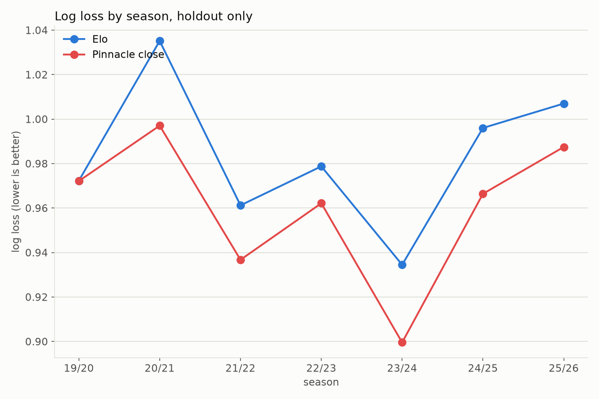
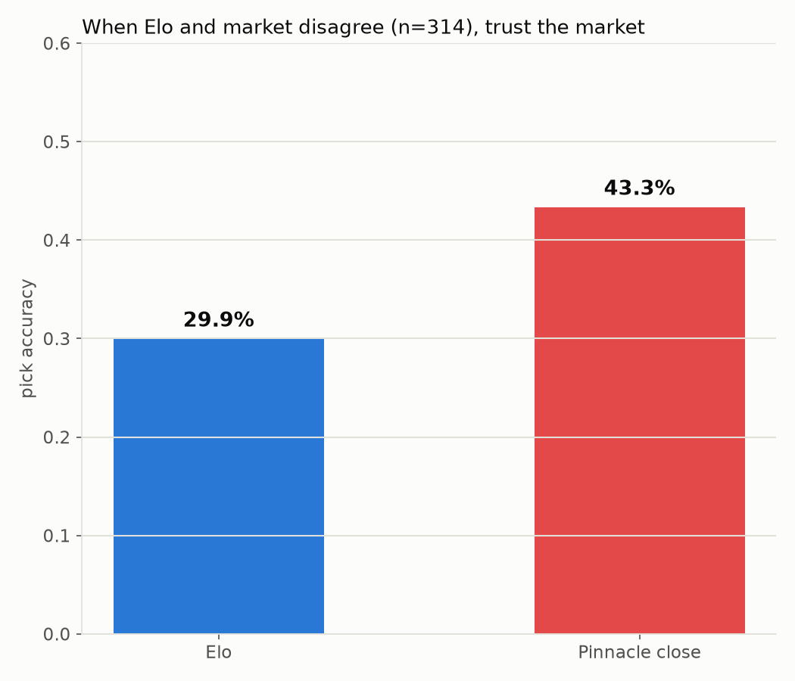
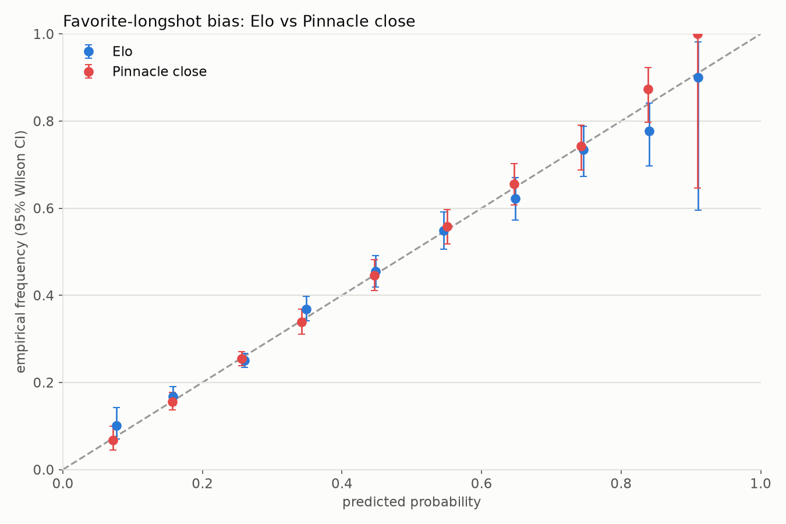
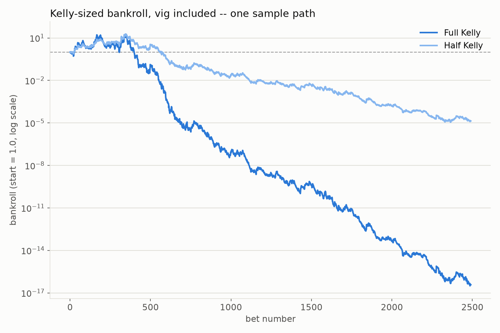
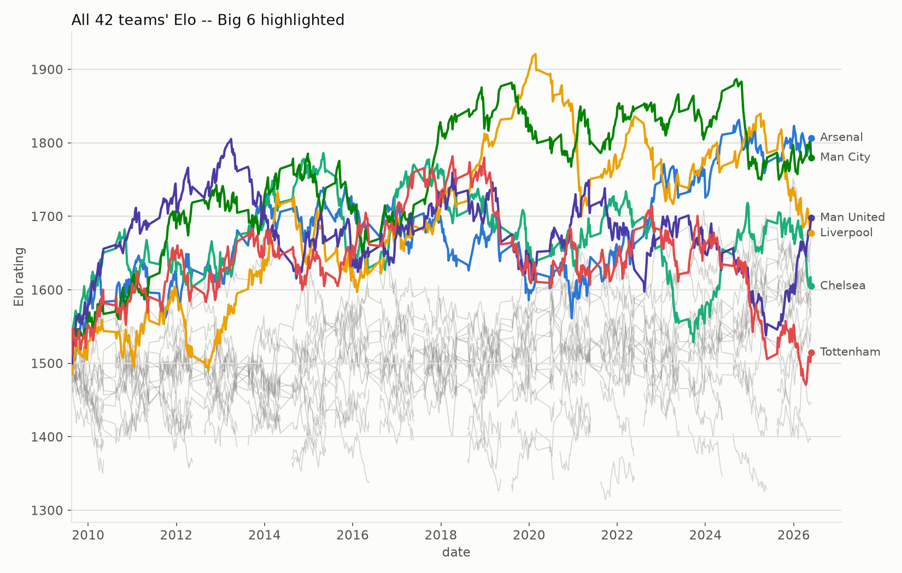

# market-efficiency

[](https://github.com/Sp0ozy/market-efficiency/actions/workflows/tests.yml)

Can a simple Elo rating, built from nothing but final scores, keep up with a
sharp bookmaker's closing line? I built this to find out, using seven seasons
of Premier League results as the test case. Short answer: no, and the code is
set up so that if it ever said yes, I'd treat that as a bug, not a win.

This is a testing harness, not a betting model. Nothing here is meant to be
used to place real bets.

## The question

Elo only sees who played whom and who won. Pinnacle's closing line sees that,
plus injuries, lineups, weather, and however much sharp money moved the price
in the hours before kickoff. If markets do their job, the closing line should
beat Elo on every match it's priced. I wanted to check that directly, and then
ask a follow-up: when the two disagree, is there any pattern to who's right?

## The result

Holdout evaluation, `2019-08-09` to `2026-01-08`, 2,490 matches (the first
match of the 2019/20 season onward, the intersection of Pinnacle's and
Bet365's odds coverage). Elo was tuned only on matches before this window.

| model | log loss | brier |
|---|---|---|
| uniform (1/3, 1/3, 1/3) | 1.0986 | 0.6667 |
| base rate (train-only) | 1.0708 | 0.6483 |
| home team always wins | 3.8903 | 1.1227 |
| **Elo** | **0.9820** | **0.5837** |
| Pinnacle closing | 0.9584 | 0.5677 |
| Pinnacle early | 0.9623 | 0.5705 |
| Bet365 closing | 0.9583 | 0.5675 |
| Bet365 early | 0.9632 | 0.5708 |

Lower is better on both columns. Elo beats every baseline by a wide margin,
which is the sanity check: if it didn't, there'd be a bug in the rating loop.
But every bookmaker's line beats Elo, closing lines beat early lines, and the
gap between Elo and the two closing lines is about 0.024 nats of log loss per
match. That's the market's edge.

`pytest tests/` encodes this as `test_market_beats_elo`, which fails the
build if Elo ever wins. That's deliberate: on this kind of holdout, a model
beating the closing line is far more likely to mean leaked information than a
real edge.

## Where the gap comes from

Elo and Pinnacle's closing line pick the same favorite in 2,176 of 2,490
holdout matches (87.4%). On the 314 where they disagree, the market's pick
wins 43.3% of the time against Elo's 29.9%. So the gap isn't spread evenly;
it's concentrated in exactly the matches where Elo doesn't have enough
information to be confident, and the market does.



Season by season, the market wins every year, but not by the same amount.
2020-21 stands out: Elo's log loss jumps to 1.035 against the market's 0.997,
about triple the usual gap. That was the empty-stadium COVID season, and
Elo's home-field advantage is a fixed constant. The market re-priced home
advantage in real time; Elo couldn't.



## Is the market's edge just favorite-longshot bias?

Calibration says no, or at least not clearly. Binning by predicted
probability and comparing to the realized frequency (Wilson 95% intervals),
no bin's residual is statistically significant for either Elo or Pinnacle's
close (`corr(predicted, residual) = 0.705` for the market, which is the right
sign for favorite-longshot bias, but with 10 bins and no significant one, I
can't call this confirmed).



One caveat worth stating plainly: the de-vig method here is multiplicative,
which is known to inflate longshot probabilities relative to their fair
value. That alone can produce something that looks like favorite-longshot
bias even when there isn't any. I didn't have time to cross-check against a
different de-vig method (Shin's, for instance), so I'm not claiming more than
the data supports.

## Could you have bet this and made money?

No. I ran a Kelly-sized bankroll simulation, betting Elo's edge against
Pinnacle's actual quoted odds (vig included, not the de-vigged fair price).

- 2,434 of 2,490 matches had a positive Elo edge and got a bet
- average quoted odds on those bets: 5.23
- breakeven win rate at those odds: 28.6%, actual win rate: 27.7%
- flat-stake ROI: -3.3%

The picks are close to fair. What kills the bankroll is Kelly sizing itself:
it assumes your probabilities are the true ones, and Elo's aren't quite
calibrated enough for that assumption to hold. A near-flat realized edge,
sized as if it were real, compounds into ruin.



Full Kelly ends near zero; half Kelly survives longer but still loses almost
everything. This is one simulated path over one holdout window, not a robust
estimate of anything, and I'm treating it as exactly that.

## How the model works

Standard Elo, walk-forward: every match's prediction is recorded before that
match's rating update runs, so nothing ever leaks into its own forecast. Two
tuned knobs, `K = 25` and home-field advantage `= 75` rating points, chosen
by grid search on the training window (matches before 2019/20) only. Draw
probability isn't fixed; it's a Gaussian bump centered on an even rating gap,
also fit on the training window. New teams start at a rating of 1500.

```
diff = (r_home + hfa) - r_away
e_home = 1 / (1 + 10 ** (-diff / 400))
p_draw = draw_min + (draw_max - draw_min) * exp(-(diff / scale) ** 2)
p_home = (1 - p_draw) * e_home
p_away = (1 - p_draw) * (1 - e_home)
```

One consequence worth flagging: `draw_max` (0.295) is below 1/3, so a draw is
never the model's single most likely outcome. That's why the draw row and
column in the pick-confusion matrix are empty; it's built into the math, not
a bug in the code.



Every team that's played in the Premier League since 2009/10, with the Big
Six picked out. The gaps in a line are relegation spells; ratings pick back
up wherever a team last left off, since there's no reset or regression to
the mean built in.

## Data

Match results and odds are from
[football-data.co.uk](https://www.football-data.co.uk/), Premier League
(`E0`), seasons 2009/10 through 2025/26. Four price sources are used:
Pinnacle and Bet365, each pre-match and closing.

## Running it

```
pip install -r requirements.txt
python download.py          # fetch + cache raw seasons -> data/matches.parquet
python clean.py             # team-name normalization -> data/clean.parquet
pytest tests/ -v             # the assertion suite; run this before anything else
python tune.py               # grid search K/HFA/draw curve on the training window
python run.py                 # scores Elo across the whole Pinnacle-close window
python holdout_report.py      # the one holdout touch: scores, bias, staking
python explore_segments.py    # exploratory disagreement slices (hypothesis-generating only)
python make_figures.py        # renders reports/figures/*.png
```

Every stage writes to disk (`data/`, `reports/`) rather than passing objects
in memory between scripts, so any step can be rerun on its own once the
earlier stages have run once.

## What I'd fix next

- Cross-check the favorite-longshot finding against Shin's de-vig method,
  since the multiplicative method used here can manufacture a similar-looking
  artifact on its own.
- Let home-field advantage vary by season instead of holding it fixed; the
  2020-21 COVID season is the clearest evidence it should.
- Add a second league to check whether any of this generalizes past the
  Premier League.
- Bootstrap a confidence interval on the headline log-loss gap instead of
  reporting a single number.

## Tests

```
pytest tests/ -v
```

Four tests run on synthetic fixtures and don't need any data. The other four
run the real pipeline end to end and are skipped automatically if
`data/clean.parquet` doesn't exist (as in CI, where the raw match data isn't
checked in). The one that matters most is `test_market_beats_elo`: if it ever
fails, that means Elo beat the closing line, and per the project's own rule,
that's a signal to go find the lookahead bug, not a result to report.
